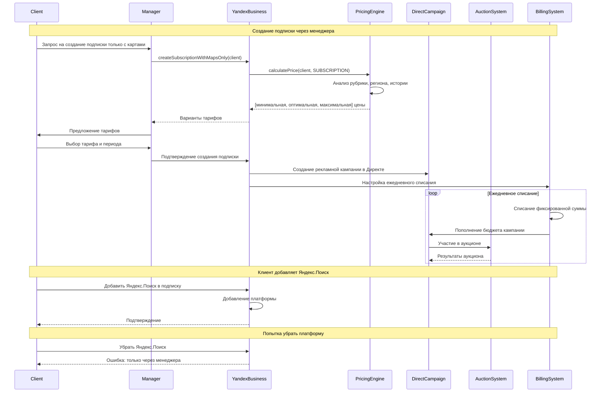
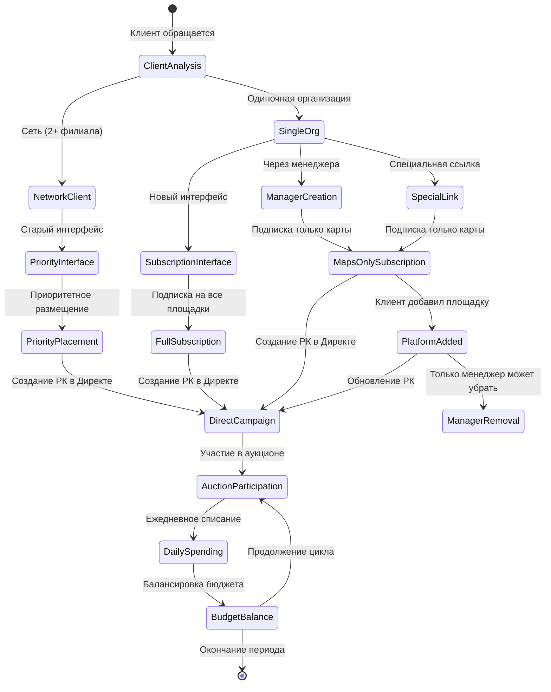

# UML Диаграмма сущностей из лога встречи

## Диаграмма классов

```mermaid
classDiagram
    class YandexBusiness {
        +createSubscription()
        +createPriorityPlacement()
        +manageClients()
    }
    
    class PlacementType {
        <<enumeration>>
        SUBSCRIPTION
        PRIORITY_PLACEMENT
    }
    
    class Subscription {
        -id: String
        -clientId: String
        -platforms: List~Platform~
        -budget: Budget
        -period: Integer
        -isManagerCreated: Boolean
        +addPlatform(Platform)
        +removePlatform(Platform)
        +calculateCost()
    }
    
    class PriorityPlacement {
        -id: String
        -clientId: String
        -placementType: PriorityType
        -budget: Budget
        -networkDiscount: Float
        +calculateNetworkDiscount()
        +createDirectCampaign()
    }
    
    class PriorityType {
        <<enumeration>>
        REGULAR_PRIORITY
        BRANDED_PRIORITY
        BRANDED_WITH_POI
    }
    
    class Client {
        -id: String
        -name: String
        -type: ClientType
        -branchCount: Integer
        -region: String
        -category: String
        -history: ClientHistory
        +canCreatePriorityPlacement(): Boolean
        +getAvailableOptions(): List~PlacementOption~
    }
    
    class ClientType {
        <<enumeration>>
        SINGLE_ORGANIZATION
        NETWORK
    }
    
    class Platform {
        -name: String
        -isActive: Boolean
        -cost: Float
    }
    
    class YandexMaps {
        -displayType: PriorityType
        +showPriority()
        +showBrandedPriority()
        +showBrandedWithPOI()
    }
    
    class YandexSearch {
        -isIncluded: Boolean
        +addToSubscription()
    }
    
    class Manager {
        -id: String
        -name: String
        +createSubscriptionWithMapsOnly(Client): Subscription
        +removePlatformFromSubscription(Subscription, Platform)
        +createPriorityPlacement(Client): PriorityPlacement
    }
    
    class Budget {
        -totalAmount: Float
        -dailySpend: Float
        -period: Integer
        -auctionPart: Float
        -brandingPart: Float
        +calculateDailySpend()
        +splitForAuction()
    }
    
    class DirectCampaign {
        -id: String
        -budget: Float
        -weeklyLimit: Float
        -isActive: Boolean
        +participateInAuction()
        +spendBudget()
        +balanceBudget()
    }
    
    class AuctionSystem {
        +runAuction(List~DirectCampaign~)
        +calculateSpending(DirectCampaign)
        +optimizeDistribution()
    }
    
    class PricingEngine {
        -analyticsContact: String
        -developerContact: String
        +calculatePrice(Client, PlacementType): List~Budget~
        +applyNetworkDiscount(Client): Float
        +getMinimalPrice(): Float
        +getOptimalPrice(): Float
        +getMaximalPrice(): Float
    }
    
    class SpecialLink {
        -url: String
        -isActive: Boolean
        -region: String
        +createMapsOnlySubscription(Client): Subscription
    }
    
    class BillingSystem {
        +processSubscriptionBilling(Subscription)
        +processPriorityBilling(PriorityPlacement)
        +dailyCharging()
    }

    %% Relationships
    YandexBusiness ||--o{ Client : manages
    YandexBusiness ||--|| PricingEngine : uses
    YandexBusiness ||--|| BillingSystem : uses
    
    Client ||--o{ Subscription : has
    Client ||--o{ PriorityPlacement : has
    Client ||--|| ClientType : is
    
    Subscription ||--o{ Platform : includes
    Subscription ||--|| Budget : has
    Subscription ||--|| PlacementType : type
    
    PriorityPlacement ||--|| PriorityType : type
    PriorityPlacement ||--|| Budget : has
    PriorityPlacement ||--|| DirectCampaign : creates
    
    Platform <|-- YandexMaps
    Platform <|-- YandexSearch
    
    Manager ||--o{ Subscription : creates
    Manager ||--o{ PriorityPlacement : creates
    
    Budget ||--|| DirectCampaign : funds
    DirectCampaign ||--|| AuctionSystem : participates
    
    PricingEngine ||--|| Client : analyzes
    SpecialLink ||--|| Subscription : creates
    
    BillingSystem ||--|| Subscription : bills
    BillingSystem ||--|| PriorityPlacement : bills
```

## Диаграмма последовательности: Создание подписки



## Диаграмма состояний: Жизненный цикл размещения



## Основные сущности и их роли

### Бизнес-сущности
- **YandexBusiness** - основная система управления размещением
- **Client** - клиент с характеристиками (тип, регион, рубрика, история)
- **Manager** - менеджер с расширенными правами создания и управления

### Продуктовые сущности
- **Subscription** - подписка с гибким набором платформ
- **PriorityPlacement** - приоритетное размещение для сетей
- **Platform** - платформы размещения (Карты, Поиск и др.)

### Технические сущности
- **DirectCampaign** - рекламная кампания в Яндекс.Директе
- **AuctionSystem** - система аукционов для определения показов
- **BillingSystem** - система биллинга с разными логиками для подписки и приоритета

### Вспомогательные сущности
- **PricingEngine** - движок расчета стоимости
- **Budget** - бюджет с разделением на аукционную и брендинговую части
- **SpecialLink** - специальная ссылка для создания подписки только с картами